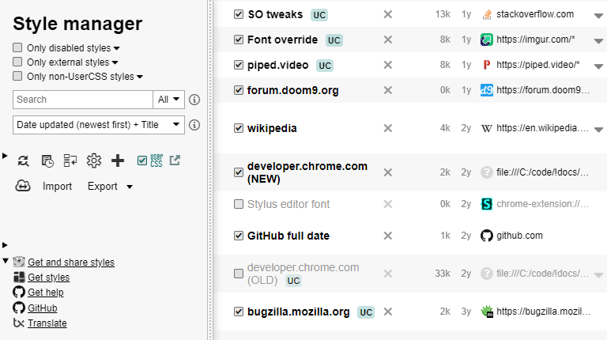
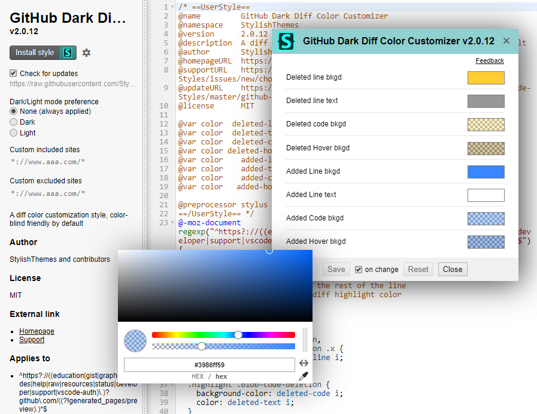
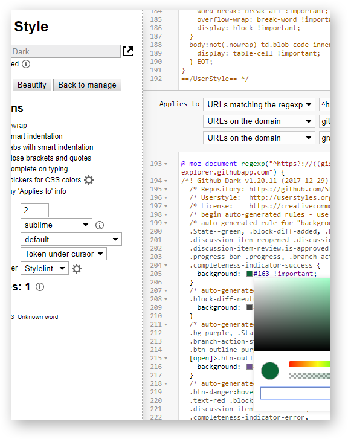
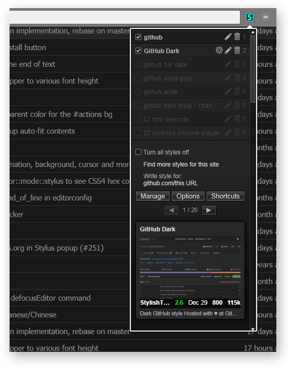
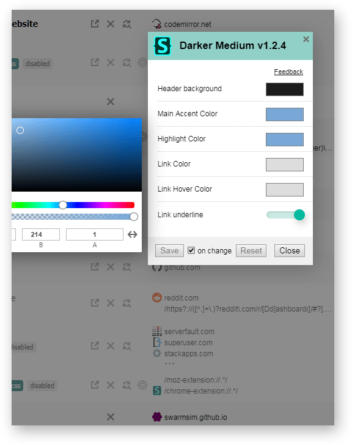
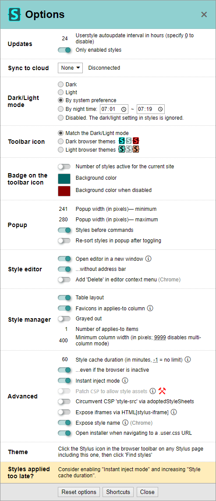

# Stylus

Stylus is a fork of Stylish for Chrome, also compatible with Firefox as a WebExtension

## Highlights

* Lightweight content script (10kB) runs in about a millisecond so it doesn't slow down web pages
* In addition to the userstyles.org site, styles with customizable parameters can also be installed from .user.css or .user.styl URLs (see [Usercss format wiki](https://github.com/openstyles/stylus/wiki/Usercss)).
* Site styles can be discovered and previewed in the popup using inline search with screenshot thumbnails.
* A backup feature which is compatible with other userstyles managers.
* Configurable automatic update function for installed styles.
* Customizable UI, optional layouts, and tweaks.
* Two different optional code validators with user-configurable rules: CSSLint and Stylelint.
  * Both validators use Web Worker API to run in a separate background thread inside the editor tab without blocking your interaction with the code.
  * CSSLint is heavily modified compared to the effectively frozen original one and supports various CSS3 features as well as CSS4 Color and CSS Grid syntax.

## Releases

1. [Chrome Web Store](https://chrome.google.com/webstore/detail/stylus/clngdbkpkpeebahjckkjfobafhncgmne) or [beta](https://chrome.google.com/webstore/detail/stylus-beta/apmmpaebfobifelkijhaljbmpcgbjbdo)
2. [Firefox add-ons](https://addons.mozilla.org/firefox/addon/styl-us/) or [beta](https://github.com/openstyles/stylus/releases) (as an xpi file)

In Opera browser please use our extension from Chrome Web Store, see [the instruction](https://github.com/openstyles/stylus/wiki/Opera,-Outdated-Stylus).

## Nightly test builds 

Downloading requires a github.com account.

1. open https://github.com/openstyles/stylus/actions/workflows/ci.yml
2. open an entry and download the build listed in `Artifacts` e.g. `stylus-chrome-mv3-3.0.7-fc0999b` is a ManifestV3 build for Chrome/Chromium 128 or newer, `fc0999b` is the commit hash.
3. Install it as an unpacked extension in Chrome or as a temporary extension in Firefox.

In Chrome, it runs in parallel to the existing Stylus extension from the web store if you have one, so you may want to disable it while testing. This is because the id is not pinned and is generated from the full directory path of the unpacked extension.

In Firefox, it'll temporarily replace the existing Stylus extension. To restore the main extension, restart the browser.

<h2>Screenshots</h2>

* Manager

   

* Installer

  

* Editor

  

* Popup search

  

* Popup config

  

* Manager config

  

* Options

  

## Help

* [Stylus help and FAQ in our Wiki](https://github.com/openstyles/stylus/wiki)
* [Discussion section](https://add0n.com/stylus.html#reviews) of our representation on add0n.com
* Discord: [![Discord][chat-image]][chat-link]

[chat-image]: https://img.shields.io/discord/379521691774353408.svg
[chat-link]: https://discordapp.com/widget?id=379521691774353408

## Contributing

The source is hosted on [GitHub](https://github.com/openstyles/stylus) and pull requests are welcome.

You can help us translate the extension on [Transifex](https://www.transifex.com/github-7/Stylus).

See our [contributing](./.github/CONTRIBUTING.md) page for more details.

## License

Inherited code from the original [Stylish](https://github.com/stylish-userstyles/stylish/):

Copyright &copy; 2005-2014 [Jason Barnabe](jason.barnabe@gmail.com)

Current Stylus:

Copyright &copy; 2017-2023 [Stylus Team](https://github.com/openstyles/stylus/graphs/contributors)

**[GNU GPLv3](./LICENSE)**

This program is free software: you can redistribute it and/or modify
it under the terms of the GNU General Public License as published by
the Free Software Foundation, either version 3 of the License, or
(at your option) any later version.

This program is distributed in the hope that it will be useful,
but WITHOUT ANY WARRANTY; without even the implied warranty of
MERCHANTABILITY or FITNESS FOR A PARTICULAR PURPOSE.  See the
GNU General Public License for more details.

You should have received a copy of the GNU General Public License
along with this program.  If not, see <https://www.gnu.org/licenses/>.

### External libraries

The licenses of [external libraries](./vendor) used in this project or [modified versions of external libraries](./vendor-overwrites) can be found in their respective directory.
